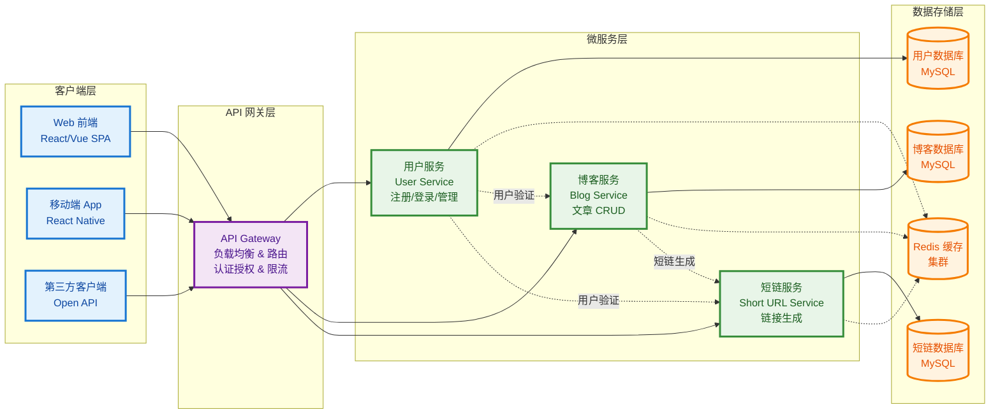

# MiniBlog 微服务系统需求文档

## 1. 文档概述

### 1.1 系统背景

MiniBlog 是一个小型博客系统，旨在为用户提供创建、分享和管理博客文章的平台。不同于大型博客平台（如 WordPress），MiniBlog 聚焦于核心功能，采用微服务架构以提高可扩展性和维护性。系统使用 go-zero 作为开发框架，该框架支持高效的 RPC、API Gateway 和服务发现，适合构建高性能的 Go 语言微服务。

系统的主要用户包括：

- 普通用户：注册、登录、发布博客、阅读文章、分享短链接。
- 管理员（可选扩展）：管理用户和内容（本版本暂不重点实现）。

请求链路强调了分层设计：客户端通过 HTTP/RESTful 接口访问 API 层，API 层负责路由和初步验证，然后通过 RPC 调用相应的微服务 RPC 层，RPC 层处理业务逻辑并访问独立的 MySQL 数据库。

### 1.2 文档范围

系统功能描述、微服务划分、数据交互逻辑、基本接口规范、结合用户提供的数据库设计（例如用户服务的 miniblog_user 数据库）。

### 1.3 术语定义

- **微服务**：独立部署的模块化服务，每个服务处理特定业务逻辑，通过 RPC 或 HTTP 通信，每个服务使用独立的数据库。
- **go-zero**：一个 Go 语言微服务框架，提供 API、RPC、缓存等工具。
- **短链**：短链接服务，用于生成和管理短网址，便于分享博客文章。
- **RPC**：远程过程调用，用于服务间通信。
- **API Gateway**：统一入口，处理外部请求并路由到相应微服务。
- **请求链路**：client → api → rpc → mysql，确保分层隔离和高效通信。

## 2. 系统概述

### 2.1 系统目标

- 提供一个高效、可靠的博客平台，支持用户创建和分享内容。
- 通过微服务架构，实现服务解耦，便于独立开发、测试和扩展，每个服务使用独立的数据库以避免数据耦合。
- 利用短链服务，提升内容分享的便利性（例如，将长博客 URL 转换为短链接）。
- 确保系统安全、性能良好，支持中等规模的用户访问，遵循 client → api → rpc → mysql 的链路。

### 2.2 系统功能摘要

- **用户服务**：处理用户身份管理和认证，使用独立的 miniblog_user 数据库。
- **博客服务**：核心博客功能，包括文章的创建、编辑、查询和删除，使用独立的 miniblog_blog 数据库。
- **短链服务**：生成和管理短链接，用于博客文章的外部分享，使用独立的 miniblog_shortlink 数据库。
- **整体交互**：用户通过 API Gateway 访问系统，服务间通过 RPC 通信；数据存储使用独立的 MySQL 数据库和缓存。

### 2.3 用户角色

- **未注册用户**：浏览公开博客文章。
- **注册用户**：登录、发布/编辑博客、生成短链分享。
- **系统管理员**（未来扩展）：审核内容、封禁用户。

## 3. 系统架构

### 3.1 整体架构图

- **前端/客户端**：Web 或移动端（RESTful API）。
- **API Gateway**：使用 go-zero 的 API 模块，作为统一入口，处理认证、路由和负载均衡。
- **微服务层（RPC）**：
  - 用户服务：独立处理用户相关逻辑，访问 miniblog_user 数据库。
  - 博客服务：管理博客内容，依赖用户服务进行认证，访问 miniblog_blog 数据库。
  - 短链服务：生成短链接，依赖博客服务获取原始 URL，访问 miniblog_shortlink 数据库。
- **数据层**：每个服务使用独立的 MySQL 数据库（CHARACTER SET utf8mb4 COLLATE utf8mb4_general_ci）；Redis（缓存短链和热点数据）。
- **通信**：服务间使用 go-zero 的 RPC；外部使用 HTTP/JSON。
- **请求链路**：客户端发送请求到 API 层 → API 层调用相应 RPC 服务 → RPC 服务处理逻辑并访问 MySQL → 返回响应逆向流动。
- **部署**：每个服务可独立容器化（Docker），使用 Kubernetes 编排（可选）。

### 3.2 微服务划分理由

- **用户服务**：隔离身份管理，提高安全性（例如，单独处理 JWT 令牌和用户数据），使用独立数据库避免其他服务直接访问用户敏感信息。
- **博客服务**：聚焦内容核心，易于扩展（如添加评论功能），独立数据库存储文章数据。
- **短链服务**：独立处理链接生成，防止博客服务负载过重；支持高并发查询，独立数据库管理链接映射。

## 4. 功能需求

### 4.1 用户服务

该服务负责用户生命周期管理，确保系统安全访问，使用 miniblog_user 数据库。

- **用户注册**：
  - 输入：用户名、密码、邮箱、手机号等（参考数据库字段）。
  - 输出：注册成功，返回用户 ID。
  - 逻辑：验证唯一性（用户名、邮箱、手机号），加密密码存储；记录注册 IP 和来源。

- **用户登录**：
  - 输入：用户名/邮箱/手机号、密码。
  - 输出：JWT 令牌（包含用户 ID 和角色）。
  - 逻辑：验证凭证，检查失败登录次数（超过 5 次锁定），更新最后登录时间/IP；生成令牌（有效期 24 小时）。

- **用户认证**：
  - 输入：JWT 令牌。
  - 输出：用户信息或认证失败。
  - 逻辑：解析令牌，检查有效性、状态和风险标志。

- **用户 profile 更新**：
  - 输入：用户 ID、新信息（年龄、头像、性别等）。
  - 输出：更新成功。
  - 逻辑：仅限认证用户操作，更新 updated_at。

- **用户注销**：
  - 输入：用户 ID。
  - 输出：注销成功。
  - 逻辑：软删除（设置 deleted_at），删除相关会话。

- **其他功能**：邮箱/手机号验证、密码重置、风险用户标记等（基于数据库字段）。

### 4.2 博客服务

该服务处理博客文章的核心操作，依赖用户服务进行认证，使用独立的 miniblog_blog 数据库。

- **创建博客**：
  - 输入：标题、内容、标签、用户 ID（从 JWT 获取）。
  - 输出：文章 ID 和 URL。
  - 逻辑：存储文章，确保用户已认证；支持 Markdown 格式。

- **编辑博客**：
  - 输入：文章 ID、新标题/内容。
  - 输出：更新成功。
  - 逻辑：仅作者可编辑。

- **删除博客**：
  - 输入：文章 ID。
  - 输出：删除成功。
  - 逻辑：仅作者或管理员，软删除。

- **查询博客**：
  - 输入：文章 ID 或搜索条件（标签、作者）。
  - 输出：文章详情列表（分页支持）。
  - 逻辑：公开文章无需认证，私有需检查权限。

- **浏览统计**：
  - 输入：文章 ID。
  - 输出：浏览次数。
  - 逻辑：使用 Redis 增量计数。

### 4.3 短链服务

该服务用于生成和管理短链接，便于社交分享，使用独立的 miniblog_shortlink 数据库。

- **生成短链**：
  - 输入：原始 URL（例如博客文章 URL）。
  - 输出：短链 URL（例如 <http://clin.pro/abc123）。>
  - 逻辑：使用哈希算法生成唯一短码，存储映射；支持过期时间（默认一个月）。

- **重定向短链**：
  - 输入：短链 URL。
  - 输出：重定向到原始 URL。
  - 逻辑：查询映射，记录访问日志。

- **查询短链信息**：
  - 输入：短链码。
  - 输出：原始 URL、创建时间、访问次数。
  - 逻辑：仅创建者可查询。

- **删除短链**：
  - 输入：短链码。
  - 输出：删除成功。
  - 逻辑：仅创建者。

### 4.4 服务间交互

- 博客服务调用用户服务（RPC）：认证用户。
- 短链服务调用博客服务（RPC）：验证 URL 有效性。
- 示例流程：用户发布博客 → 生成短链 → 分享；整个链路遵循 client → api → rpc → mysql。

## 5. 非功能需求

### 5.1 性能需求

- 响应时间：API 调用 < 200ms，整个链路优化。
- 并发：支持 1000 QPS（每服务）。
- 扩展性：微服务支持水平扩展，独立数据库便于分片。

### 5.2 安全需求

- 认证：JWT + HTTPS。
- 数据加密：密码哈希（参考 password 字段）、敏感信息加密。
- 防护：防 SQL 注入、XSS；限流防 DDoS；失败登录尝试计数。

### 5.3 可用性需求

- 可用性：99.9% 上线率。
- 日志：使用 go-zero 的日志模块，监控错误。

### 5.4 兼容性需求

- 后端：Go 1.22+，go-zero 最新版。
- 数据库：MySQL 8.0（每个服务独立数据库），Redis 6.0。
- 前端：支持 RESTful API，兼容浏览器/移动端。

## 6. 数据模型

### 6.1 数据库设计

每个服务使用独立的数据库：

- **用户服务**：miniblog_user 数据库，CHARACTER SET utf8mb4 COLLATE utf8mb4_general_ci。
- **博客服务**：miniblog_blog 数据库（类似设计）。
- **短链服务**：miniblog_shortlink 数据库（类似设计）。

脚本示例（基于用户提供，用于用户服务）：

- 创建数据库：CREATE DATABASE IF NOT EXISTS miniblog_user ...
- 删除表：DROP TABLE IF EXISTS user; DROP TABLE IF EXISTS casbin_rule;（casbin_rule 用于权限管理，可扩展 RBAC）。

### 6.2 数据库表设计（MySQL 示例）

- **用户表 (users，在 miniblog_user 数据库)**：
  - id (BIGINT, AUTO_INCREMENT, PK)：用户ID
  - user_id (VARCHAR(32), NOT NULL)：用户ID
  - age (INT)：年龄
  - avatar (VARCHAR(255))：头像URL
  - username (VARCHAR(100), NOT NULL)：用户名
  - password (VARCHAR(255), NOT NULL)：密码
  - password_updated_at (TIMESTAMP)：密码更新时间
  - email (VARCHAR(100), NOT NULL, UNIQUE)：邮箱
  - email_verified (TINYINT, DEFAULT 0)：邮箱是否已验证；1-已验证,0-未验证
  - phone (VARCHAR(20), NOT NULL, UNIQUE)：手机号
  - phone_verified (TINYINT, DEFAULT 0)：手机号是否已验证；1-已验证,0-未验证
  - gender (TINYINT, DEFAULT 0)：性别：0-未设置，1-男，2-女，3-其他
  - status (TINYINT, DEFAULT 1)：状态：1-正常，0-禁用
  - failed_login_attempts (INT, DEFAULT 0)：失败登录次数，超过5次则锁定账户，登录成功后重置
  - last_login_at (TIMESTAMP, NULL)：最后登录时间
  - last_login_ip (VARCHAR(45))：最后登录IP
  - is_risk (TINYINT, DEFAULT 0)：是否为风险用户；1-是,0-否
  - register_source (TINYINT, DEFAULT 1)：注册来源：1-web，2-app，3-wechat，4-qq，5-github，6-google
  - register_ip (VARCHAR(45))：注册IP
  - wechat_openid (VARCHAR(100))：微信OpenID
  - created_at (TIMESTAMP, DEFAULT CURRENT_TIMESTAMP())：创建时间
  - updated_at (TIMESTAMP, DEFAULT CURRENT_TIMESTAMP() ON UPDATE CURRENT_TIMESTAMP())：更新时间
  - deleted_at (TIMESTAMP, NULL)：删除时间

  - 唯一索引：uk_user_id, uk_username, uk_email, uk_phone, uk_wechat_openid
  - 基础索引：idx_status, idx_deleted_at

- **博客表 (blogs，在 miniblog_blog 数据库)**：
  - id (PK, int)
  - user_id (FK, int)
  - title (varchar)
  - content (text)
  - tags (varchar)
  - created_at (timestamp)
  - updated_at (timestamp)
  - deleted_at (timestamp)
  - views (int, default 0)

- **短链表 (short_links，在 miniblog_shortlink 数据库)**：
  - id (PK, int)
  - short_code (varchar, unique)
  - original_url (varchar)
  - user_id (FK, int)
  - expires_at (timestamp)
  - visits (int, default 0)
  - created_at (timestamp)
  - updated_at (timestamp)
  - deleted_at (timestamp)

- **权限表 (casbin_rule，可在用户服务数据库扩展)**：用于 Casbin RBAC 权限管理（例如角色、策略），字段根据 Casbin 标准设计。

### 6.3 缓存设计（Redis）

- 热点用户数据：key = "user:info:{user_id}"，value = 用户基本信息。
- 热点博客：key = "blog:views:{id}"，value = 浏览次数。
- 短链映射：key = "short:{code}"，value = 原始 URL。

## 7. 接口规范

### 7.1 API 示例（RESTful，使用 go-zero API，客户端访问点）

- **用户服务**：
  - POST /user/register {username, password, email, phone, ...} → {user_id}
  - POST /user/login {username, password} → {token，expireAt}

- **博客服务**：
  - POST /blog/create {title, content, tags} (Header: Authorization) → {blog_id, url}
  - GET /blog/{id} → {title, content, ...}

- **短链服务**：
  - POST /short/create {original_url} → {short_url}
  - GET /{short_code} → 重定向

### 7.2 RPC 接口（服务间，go-zero RPC）

- 用户服务：VerifyToken(token string) → UserInfo (包括 user_id, status 等)
- 博客服务：GetBlogURL(id int) → string

## 8. 风险与假设

- **假设**：用户需求未指定高级功能（如评论、搜索），本文档聚焦核心；其他服务数据库设计类似用户服务。
- **风险**：服务间 RPC 延迟；短链碰撞（使用长码缓解）；独立数据库一致性（使用事务或消息队列）。
- **扩展点**：添加 Casbin 权限、通知服务或搜索服务。
