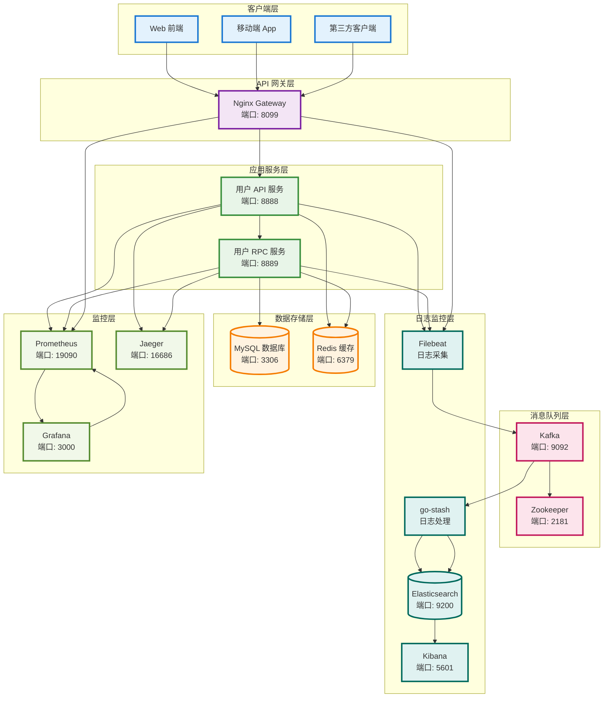
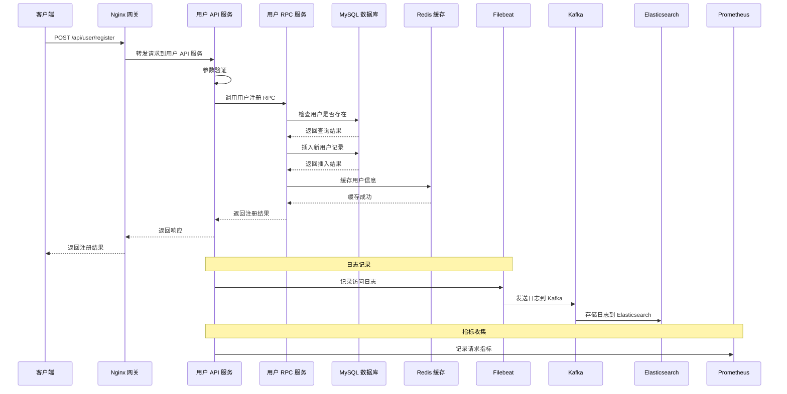
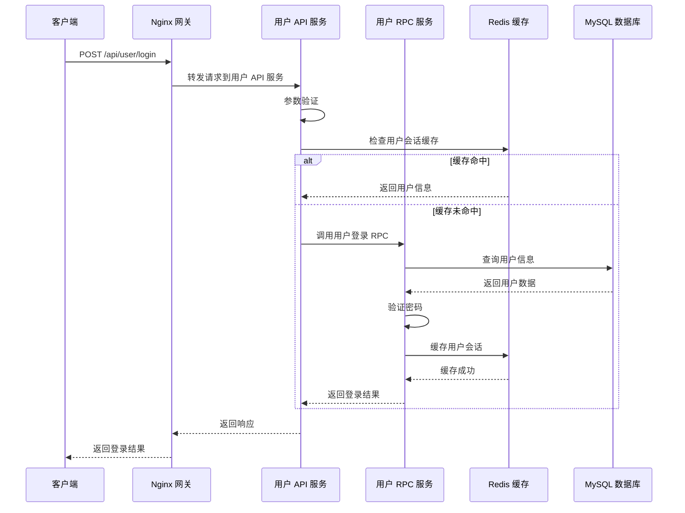
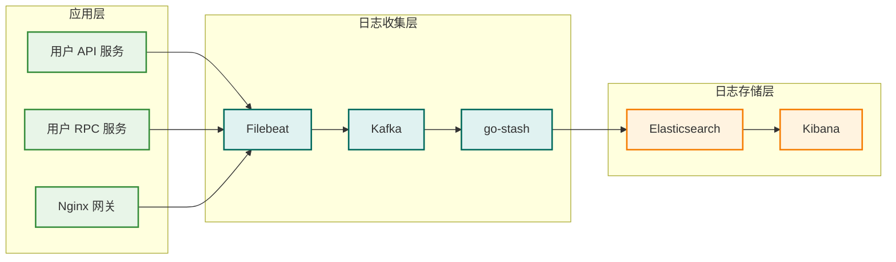
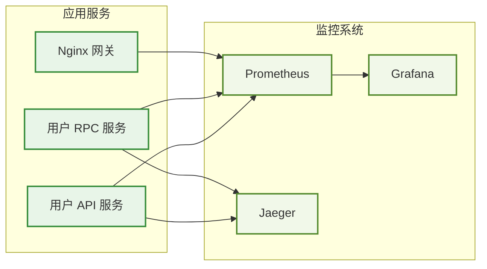
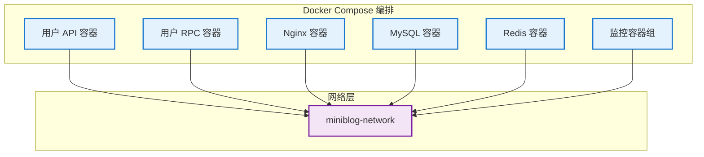

# MiniBlog 微服务架构分析

## 1. 系统架构概览

MiniBlog 采用微服务架构，基于 Go-Zero 框架构建，包含以下核心组件：

### 1.1 服务组件

- **API 网关**: Nginx (端口 8099)
- **用户 API 服务**: Go-Zero API 服务 (端口 8888)
- **用户 RPC 服务**: Go-Zero RPC 服务 (端口 8889)
- **数据库**: MySQL 8.0 (端口 3306)
- **缓存**: Redis 7 (端口 6379)

### 1.2 监控组件

- **日志收集**: Filebeat + Kafka + go-stash + Elasticsearch
- **日志分析**: Kibana (端口 5601)
- **指标监控**: Prometheus (端口 19090)
- **监控面板**: Grafana (端口 3000)
- **链路追踪**: Jaeger (端口 16686)

## 2. 组件依赖关系图



## 3. 详细执行链路分析

### 3.1 用户注册流程



### 3.2 用户登录流程



## 4. 日志系统架构

### 4.1 日志收集链路



### 4.2 日志配置详情

#### 4.2.1 应用日志配置

- **用户 API 服务**: `/var/log/app/user-api/`
- **用户 RPC 服务**: `/var/log/app/user-rpc/`
- **Nginx 网关**: `/var/log/app/nginx/`

#### 4.2.2 Filebeat 配置

```yaml
# 日志输入配置
filebeat.inputs:
- type: log
  paths:
  - /var/log/app/user-api/*.log
  fields:
    service: user-api
    service_type: api
    env: dev

# 输出到 Elasticsearch
output.elasticsearch:
  hosts: ["elasticsearch:9200"]
  index: "miniblog-logs-%{+yyyy.MM.dd}"
```

#### 4.2.3 go-stash 配置

```yaml
# 从 Kafka 消费日志并写入 Elasticsearch
Clusters:
- Input:
    Kafka:
      Brokers: ["kafka:29092"]
      Topics: ["filebeat-logs"]
  Output:
    ElasticSearch:
      Hosts: ["http://elasticsearch:9200"]
      Index: "miniblog-logs-{service}-{yyyy.MM.dd}"
```

## 5. 监控系统架构

### 5.1 监控指标收集



### 5.2 关键监控指标

#### 5.2.1 应用性能指标

- **请求响应时间**: API 和 RPC 服务的响应时间
- **请求吞吐量**: QPS (每秒查询数)
- **错误率**: HTTP 4xx/5xx 错误率
- **并发连接数**: 当前活跃连接数

#### 5.2.2 系统资源指标

- **CPU 使用率**: 各服务的 CPU 占用
- **内存使用率**: 内存占用情况
- **磁盘 I/O**: 数据库和日志的磁盘操作
- **网络流量**: 网络带宽使用情况

#### 5.2.3 业务指标

- **用户注册数**: 每日新增用户数
- **用户活跃度**: 日活跃用户数
- **API 调用量**: 各接口的调用次数
- **缓存命中率**: Redis 缓存效率

## 6. 性能分析

### 6.1 性能瓶颈分析

#### 6.1.1 数据库层面

- **慢查询监控**: MySQL 慢查询日志分析
- **连接池管理**: 数据库连接池配置优化
- **索引优化**: 数据库索引策略

#### 6.1.2 缓存层面

- **缓存命中率**: Redis 缓存效率监控
- **缓存穿透**: 防止缓存穿透策略
- **缓存雪崩**: 缓存失效时间分散

#### 6.1.3 网络层面

- **网关性能**: Nginx 负载均衡效率
- **服务间通信**: RPC 调用性能
- **带宽使用**: 网络流量监控

### 6.2 性能优化策略

#### 6.2.1 应用层优化

- **连接池复用**: 数据库和 Redis 连接池
- **异步处理**: 非关键操作异步化
- **批量操作**: 减少数据库交互次数

#### 6.2.2 架构层优化

- **服务拆分**: 按业务域拆分服务
- **缓存策略**: 多级缓存架构
- **负载均衡**: 服务实例水平扩展

## 7. 部署架构

### 7.1 Docker 容器编排



### 7.2 服务依赖关系

#### 7.2.1 启动顺序

1. **基础设施服务**: MySQL, Redis, Zookeeper, Kafka
2. **监控服务**: Elasticsearch, Prometheus, Jaeger
3. **应用服务**: 用户 RPC 服务, 用户 API 服务
4. **网关服务**: Nginx 网关
5. **日志服务**: Filebeat, go-stash, Kibana, Grafana

#### 7.2.2 健康检查

- **服务健康检查**: 各服务的 `/health` 端点
- **数据库连接检查**: 数据库连接池状态
- **缓存连接检查**: Redis 连接状态

## 8. 故障排查指南

### 8.1 常见问题排查

#### 8.1.1 服务不可用

1. **检查容器状态**: `docker ps`
2. **查看服务日志**: `docker logs <container_name>`
3. **检查网络连接**: `docker network inspect miniblog-network`
4. **验证端口监听**: `netstat -tlnp`

#### 8.1.2 性能问题

1. **查看监控面板**: Grafana 仪表板
2. **分析日志**: Kibana 日志分析
3. **检查资源使用**: CPU, 内存, 磁盘使用率
4. **数据库性能**: MySQL 慢查询分析

#### 8.1.3 日志问题

1. **检查 Filebeat 状态**: `docker logs miniblog-filebeat`
2. **验证 Kafka 连接**: Kafka UI 界面
3. **检查 Elasticsearch**: `curl http://localhost:9200/_cluster/health`
4. **查看 go-stash 日志**: `docker logs miniblog-go-stash`

### 8.2 监控告警配置

#### 8.2.1 Prometheus 告警规则

```yaml
groups:
- name: miniblog-alerts
  rules:
  - alert: HighErrorRate
    expr: rate(http_requests_total{status=~"5.."}[5m]) > 0.1
    for: 5m
    labels:
      severity: warning
    annotations:
      summary: "高错误率告警"
      description: "服务错误率超过 10%"

  - alert: HighResponseTime
    expr: histogram_quantile(0.95, rate(http_request_duration_seconds_bucket[5m])) > 1
    for: 5m
    labels:
      severity: warning
    annotations:
      summary: "高响应时间告警"
      description: "95% 请求响应时间超过 1 秒"
```

#### 8.2.2 Grafana 告警通知

- **邮件通知**: 配置 SMTP 服务器
- **钉钉通知**: 配置钉钉机器人
- **Slack 通知**: 配置 Slack Webhook

## 9. 扩展性设计

### 9.1 水平扩展策略

#### 9.1.1 服务扩展

- **API 服务扩展**: 通过 Nginx 负载均衡
- **RPC 服务扩展**: 通过服务发现机制
- **数据库扩展**: 读写分离 + 分库分表

#### 9.1.2 缓存扩展

- **Redis 集群**: 主从复制 + 哨兵模式
- **多级缓存**: 本地缓存 + 分布式缓存

### 9.2 垂直扩展策略

#### 9.2.1 资源配置优化

- **CPU 优化**: 调整 Go 运行时参数
- **内存优化**: 连接池和缓存配置
- **磁盘优化**: SSD 存储 + RAID 配置

## 10. 安全架构

### 10.1 网络安全

- **API 网关安全**: 请求限流和认证
- **服务间通信**: TLS 加密传输
- **数据库安全**: 网络隔离和访问控制

### 10.2 应用安全

- **参数验证**: 输入参数严格校验
- **SQL 注入防护**: 参数化查询
- **XSS 防护**: 输出内容转义

### 10.3 数据安全

- **敏感数据加密**: 密码等敏感信息加密存储
- **数据备份**: 定期数据备份策略
- **访问审计**: 操作日志记录和审计
