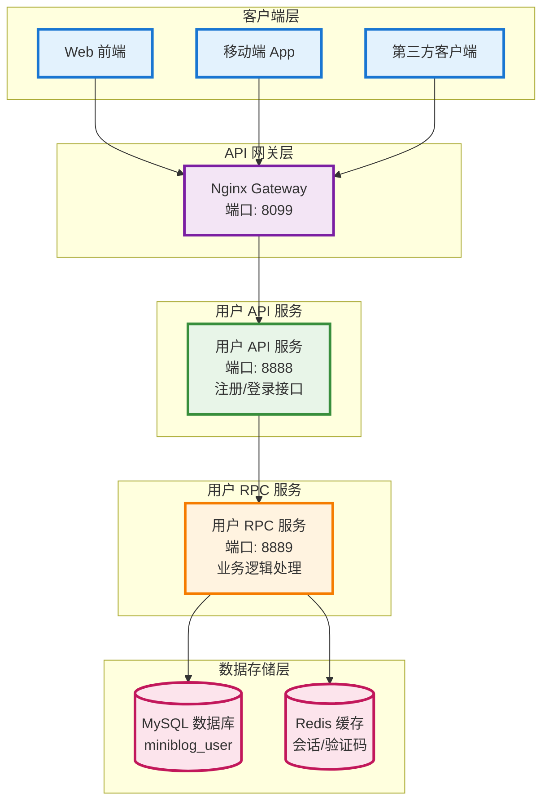
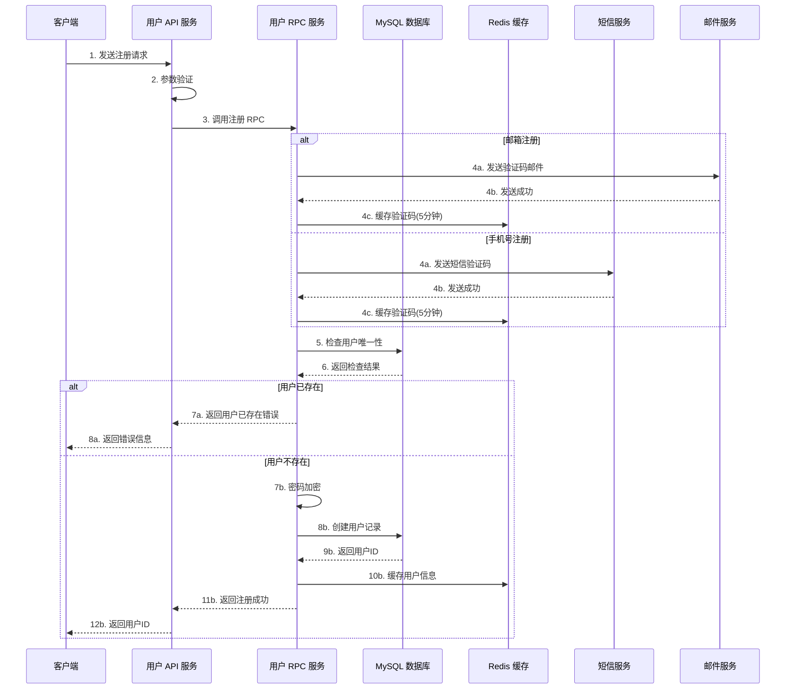
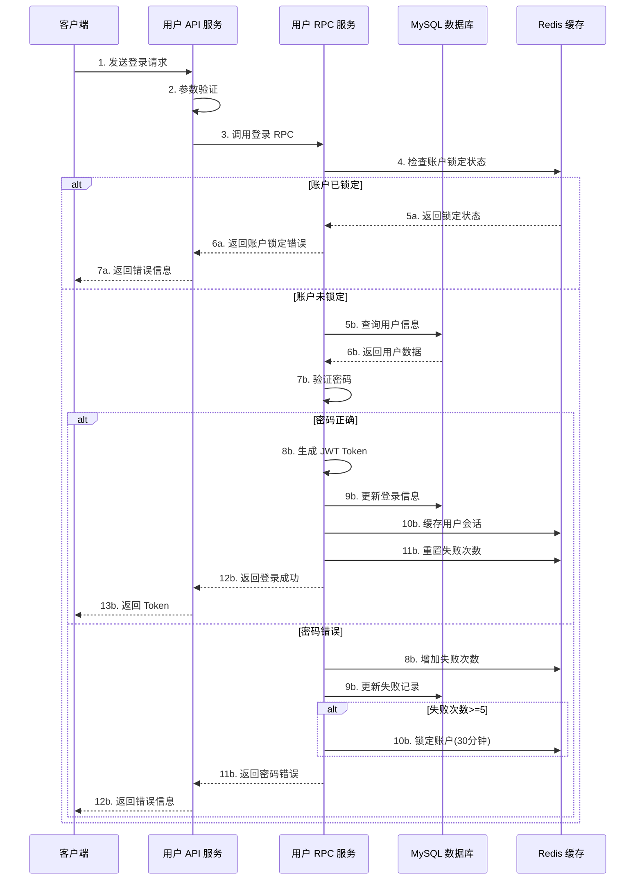
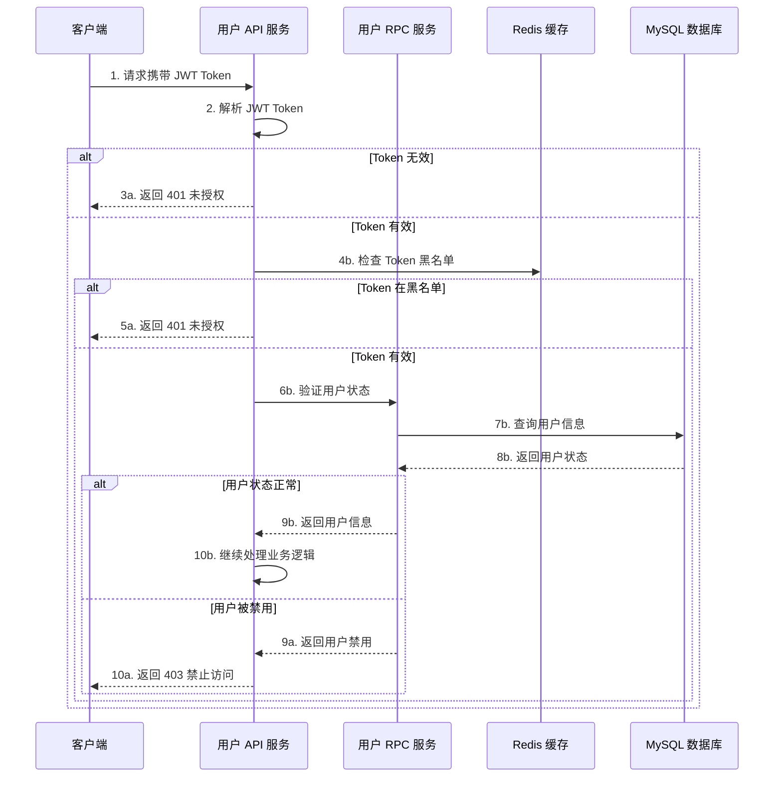

# MiniBlog 用户注册登录功能设计文档

## 1. 功能概述

### 1.1 功能背景

用户注册登录功能是 MiniBlog 系统的核心基础功能，为用户提供身份认证和授权服务。该功能基于微服务架构设计，采用 Go-Zero 框架实现，确保系统安全性和可扩展性。

### 1.2 功能目标

- **用户注册**: 提供多种注册方式，支持用户名、邮箱、手机号注册
- **用户登录**: 支持多种登录方式，包含安全验证机制
- **身份认证**: 基于 JWT 的无状态认证机制
- **安全防护**: 防暴力破解、账户锁定、风险用户标记
- **用户体验**: 快速响应、友好的错误提示

### 1.3 技术架构



## 2. 功能需求详细设计

### 2.1 用户注册功能

#### 2.1.1 注册方式

- **用户名注册**: 用户名 + 密码 + 邮箱/手机号
- **邮箱注册**: 邮箱 + 密码 + 验证码
- **手机号注册**: 手机号 + 密码 + 短信验证码
- **第三方注册**: 微信、QQ、GitHub、Google OAuth

#### 2.1.2 注册流程



#### 2.1.3 注册验证规则

| 字段 | 验证规则 | 说明 |
|------|----------|------|
| 用户名 | 3-20字符，字母数字下划线 | 唯一性检查 |
| 密码 | 8-32字符，包含字母数字 | 强度要求 |
| 邮箱 | 标准邮箱格式 | 唯一性检查，验证码验证 |
| 手机号 | 11位数字 | 唯一性检查，短信验证码 |
| 年龄 | 1-120岁 | 可选字段 |
| 性别 | 0-3 | 0-未设置，1-男，2-女，3-其他 |

### 2.2 用户登录功能

#### 2.2.1 登录方式

- **用户名登录**: 用户名 + 密码
- **邮箱登录**: 邮箱 + 密码
- **手机号登录**: 手机号 + 密码
- **第三方登录**: OAuth 授权登录

#### 2.2.2 登录流程



#### 2.2.3 安全机制

- **失败登录限制**: 连续失败5次锁定账户30分钟
- **密码强度要求**: 最小8位，包含字母和数字
- **会话管理**: JWT Token 24小时有效期
- **风险用户标记**: 异常登录行为标记

### 2.3 身份认证功能

#### 2.3.1 JWT Token 结构

```json
{
  "header": {
    "alg": "HS256",
    "typ": "JWT"
  },
  "payload": {
    "user_id": "user_123456",
    "username": "testuser",
    "email": "test@example.com",
    "status": 1,
    "iat": 1640995200,
    "exp": 1641081600,
    "iss": "miniblog",
    "aud": "miniblog_users"
  },
  "signature": "HMACSHA256(base64UrlEncode(header) + '.' + base64UrlEncode(payload), secret)"
}
```

#### 2.3.2 认证流程



## 3. 数据库设计

### 3.1 用户表结构

```sql
-- 用户表 (users)
CREATE TABLE `users` (
  `id` bigint NOT NULL AUTO_INCREMENT COMMENT '主键ID',
  `user_id` varchar(32) NOT NULL COMMENT '用户ID',
  `username` varchar(100) NOT NULL COMMENT '用户名',
  `password` varchar(255) NOT NULL COMMENT '密码(加密)',
  `password_updated_at` timestamp NULL DEFAULT NULL COMMENT '密码更新时间',
  `email` varchar(100) NOT NULL COMMENT '邮箱',
  `email_verified` tinyint DEFAULT '0' COMMENT '邮箱是否已验证：1-已验证,0-未验证',
  `phone` varchar(20) NOT NULL COMMENT '手机号',
  `phone_verified` tinyint DEFAULT '0' COMMENT '手机号是否已验证：1-已验证,0-未验证',
  `age` int DEFAULT NULL COMMENT '年龄',
  `gender` tinyint DEFAULT '0' COMMENT '性别：0-未设置，1-男，2-女，3-其他',
  `avatar` varchar(255) DEFAULT NULL COMMENT '头像URL',
  `status` tinyint DEFAULT '1' COMMENT '状态：1-正常，0-禁用',
  `failed_login_attempts` int DEFAULT '0' COMMENT '失败登录次数',
  `last_login_at` timestamp NULL DEFAULT NULL COMMENT '最后登录时间',
  `last_login_ip` varchar(45) DEFAULT NULL COMMENT '最后登录IP',
  `is_risk` tinyint DEFAULT '0' COMMENT '是否为风险用户：1-是,0-否',
  `register_source` tinyint DEFAULT '1' COMMENT '注册来源：1-web，2-app，3-wechat，4-qq，5-github，6-google',
  `register_ip` varchar(45) DEFAULT NULL COMMENT '注册IP',
  `wechat_openid` varchar(100) DEFAULT NULL COMMENT '微信OpenID',
  `created_at` timestamp DEFAULT CURRENT_TIMESTAMP COMMENT '创建时间',
  `updated_at` timestamp DEFAULT CURRENT_TIMESTAMP ON UPDATE CURRENT_TIMESTAMP COMMENT '更新时间',
  `deleted_at` timestamp NULL DEFAULT NULL COMMENT '删除时间',
  PRIMARY KEY (`id`),
  UNIQUE KEY `uk_user_id` (`user_id`),
  UNIQUE KEY `uk_username` (`username`),
  UNIQUE KEY `uk_email` (`email`),
  UNIQUE KEY `uk_phone` (`phone`),
  UNIQUE KEY `uk_wechat_openid` (`wechat_openid`),
  KEY `idx_status` (`status`),
  KEY `idx_deleted_at` (`deleted_at`)
) ENGINE=InnoDB DEFAULT CHARSET=utf8mb4 COLLATE=utf8mb4_general_ci COMMENT='用户表';
```

### 3.2 缓存设计

#### 3.2.1 Redis 键值设计

| 键名 | 类型 | 过期时间 | 说明 |
|------|------|----------|------|
| `user:info:{user_id}` | String | 24小时 | 用户基本信息 |
| `user:session:{token}` | String | 24小时 | 用户会话信息 |
| `user:lock:{user_id}` | String | 30分钟 | 账户锁定状态 |
| `user:failed:{user_id}` | String | 30分钟 | 失败登录次数 |
| `verify:email:{email}` | String | 5分钟 | 邮箱验证码 |
| `verify:phone:{phone}` | String | 5分钟 | 短信验证码 |
| `token:blacklist:{token}` | String | 24小时 | Token 黑名单 |

#### 3.2.2 缓存数据结构

```json
// 用户信息缓存
{
  "user_id": "user_123456",
}

// 会话信息缓存
{
  "user_id": "user_123456",
  "username": "testuser",
  "login_ip": "192.168.1.100",
  "login_time": "2024-01-01T12:00:00Z",
  "expire_time": "2024-01-02T12:00:00Z"
}
```

## 4. API 接口设计

### 4.1 用户注册接口

#### 4.1.1 接口定义

```go
// RegisterRequest 用户注册请求
type RegisterRequest {
    Username       string `json:"username" valid:"required,length(3|100)"` // 用户名
    Password       string `json:"password" valid:"required,length(6|32)"` // 密码
    Email          string `json:"email" valid:"required,email"` // 邮箱
    Phone          string `json:"phone" valid:"required,length(11|20)"` // 手机号
    Age            int    `json:"age,optional" valid:"range(1|120)"` // 年龄
    Gender         int    `json:"gender,optional" valid:"range(0|3)"` // 性别
    Avatar         string `json:"avatar,optional"` // 头像URL
    RegisterSource int    `json:"registerSource,optional" valid:"range(1|6)"` // 注册来源
}

// RegisterResponse 用户注册响应
type RegisterResponse {
    UserId string `json:"userId"` // 用户ID
}
```

#### 4.1.2 请求示例

```bash
# 用户注册
POST /api/user/register
Content-Type: application/json

{
  "username": "testuser",
  "password": "password123",
  "email": "test@example.com",
  "phone": "13800138000",
  "age": 25,
  "gender": 1,
  "avatar": "https://example.com/avatar.jpg",
  "registerSource": 1
}
```

#### 4.1.3 响应示例

```json
{
  "code": 200,
  "message": "注册成功",
  "data": {
    "userId": "user_123456"
  }
}
```

### 4.2 用户登录接口

#### 4.2.1 接口定义

```go
// LoginRequest 用户登录请求
type LoginRequest {
    Username string `json:"username" valid:"required"` // 用户名/邮箱/手机号
    Password string `json:"password" valid:"required"` // 密码
}

// LoginResponse 用户登录响应
type LoginResponse {
    Token     string `json:"token"`     // JWT Token
    ExpireAt  string `json:"expireAt"`  // 过期时间
    UserId    string `json:"userId"`    // 用户ID
    Username  string `json:"username"`  // 用户名
    Avatar    string `json:"avatar"`    // 头像
}
```

#### 4.2.2 请求示例

```bash
# 用户登录
POST /api/user/login
Content-Type: application/json

{
  "username": "testuser",
  "password": "password123"
}
```

#### 4.2.3 响应示例

```json
{
  "code": 200,
  "message": "登录成功",
  "data": {
    "token": "eyJhbGciOiJIUzI1NiIsInR5cCI6IkpXVCJ9...",
    "expireAt": "2024-01-02T12:00:00Z",
    "userId": "user_123456",
    "username": "testuser",
    "avatar": "https://example.com/avatar.jpg"
  }
}
```

### 4.3 用户信息接口

#### 4.3.1 获取用户信息

```bash
# 获取用户信息
GET /api/user/:userId
Authorization: Bearer {token}
```

#### 4.3.2 更新用户信息

```bash
# 更新用户信息
PUT /api/user/:userId
Authorization: Bearer {token}
Content-Type: application/json

{
  "username": "newusername",
  "age": 26,
  "gender": 1,
  "avatar": "https://example.com/new-avatar.jpg"
}
```

## 5. RPC 服务设计

### 5.1 用户注册 RPC

#### 5.1.1 Proto 定义

```protobuf
// RegisterRequest 用户注册请求
message RegisterRequest {
  string username = 1;        // 用户名
  string password = 2;        // 密码
  string email = 3;           // 邮箱
  string phone = 4;           // 手机号
  int32 age = 5;              // 年龄
  int32 gender = 6;           // 性别
  string avatar = 7;          // 头像URL
  int32 register_source = 8;  // 注册来源
  string wechat_openid = 9;   // 微信OpenID
}

// RegisterResponse 用户注册响应
message RegisterResponse {
  string user_id = 1;         // 用户ID
}

service User {
  // Register 用户注册
  rpc Register(RegisterRequest) returns(RegisterResponse);
}
```

#### 5.1.2 业务逻辑

```go
// Register 用户注册逻辑
func (l *RegisterLogic) Register(in *pb.RegisterRequest) (*pb.RegisterResponse, error) {
    // 1. 参数验证
    if err := l.validateRegisterRequest(in); err != nil {
        return nil, err
    }
    
    // 2. 检查用户唯一性
    if err := l.checkUserUniqueness(in); err != nil {
        return nil, err
    }
    
    // 3. 密码加密
    hashedPassword, err := l.hashPassword(in.Password)
    if err != nil {
        return nil, err
    }
    
    // 4. 生成用户ID
    userId := l.generateUserId()
    
    // 5. 创建用户记录
    user := &model.User{
        UserId:         userId,
        Username:       in.Username,
        Password:       hashedPassword,
        Email:          in.Email,
        Phone:          in.Phone,
        Age:            in.Age,
        Gender:         in.Gender,
        Avatar:         in.Avatar,
        RegisterSource: in.RegisterSource,
        WechatOpenid:   in.WechatOpenid,
        RegisterIp:     l.getClientIP(),
        Status:         1,
    }
    
    // 6. 保存到数据库
    if err := l.svcCtx.UserModel.Insert(l.ctx, user); err != nil {
        return nil, err
    }
    
    // 7. 缓存用户信息
    l.cacheUserInfo(user)
    
    return &pb.RegisterResponse{
        UserId: userId,
    }, nil
}
```

### 5.2 用户登录 RPC

#### 5.2.1 Proto 定义

```protobuf
// LoginRequest 用户登录请求
message LoginRequest {
  string username = 1;        // 用户名/邮箱/手机号
  string password = 2;        // 密码
  string login_ip = 3;        // 登录IP
}

// LoginResponse 用户登录响应
message LoginResponse {
  string token = 1;           // JWT Token
  string expire_at = 2;       // 过期时间
  string user_id = 3;         // 用户ID
  string username = 4;        // 用户名
  string avatar = 5;          // 头像
}

service User {
  // Login 用户登录
  rpc Login(LoginRequest) returns(LoginResponse);
}
```

#### 5.2.2 业务逻辑

```go
// Login 用户登录逻辑
func (l *LoginLogic) Login(in *pb.LoginRequest) (*pb.LoginResponse, error) {
    // 1. 检查账户锁定状态
    if l.isAccountLocked(in.Username) {
        return nil, errors.New("账户已被锁定，请30分钟后重试")
    }
    
    // 2. 查询用户信息
    user, err := l.getUserByUsername(in.Username)
    if err != nil {
        l.recordFailedLogin(in.Username)
        return nil, errors.New("用户名或密码错误")
    }
    
    // 3. 验证密码
    if !l.verifyPassword(in.Password, user.Password) {
        l.recordFailedLogin(in.Username)
        return nil, errors.New("用户名或密码错误")
    }
    
    // 4. 检查用户状态
    if user.Status != 1 {
        return nil, errors.New("账户已被禁用")
    }
    
    // 5. 生成 JWT Token
    token, expireAt, err := l.generateJWT(user)
    if err != nil {
        return nil, err
    }
    
    // 6. 更新登录信息
    l.updateLoginInfo(user, in.LoginIp)
    
    // 7. 重置失败次数
    l.resetFailedLoginCount(in.Username)
    
    // 8. 缓存会话信息
    l.cacheSession(token, user)
    
    return &pb.LoginResponse{
        Token:     token,
        ExpireAt:  expireAt,
        UserId:    user.UserId,
        Username:  user.Username,
        Avatar:    user.Avatar,
    }, nil
}
```

## 6. 安全设计

### 6.1 密码安全

#### 6.1.1 密码加密

```go
// 使用 bcrypt 加密密码
func (l *UserLogic) hashPassword(password string) (string, error) {
    hashedBytes, err := bcrypt.GenerateFromPassword([]byte(password), bcrypt.DefaultCost)
    if err != nil {
        return "", err
    }
    return string(hashedBytes), nil
}

// 验证密码
func (l *UserLogic) verifyPassword(password, hashedPassword string) bool {
    err := bcrypt.CompareHashAndPassword([]byte(hashedPassword), []byte(password))
    return err == nil
}
```

#### 6.1.2 密码策略

- **最小长度**: 6位
- **复杂度要求**: 包含字母和数字
- **定期更新**: 建议90天更新一次
- **历史密码**: 不允许使用最近5次密码

### 6.2 账户安全

#### 6.2.1 失败登录限制

```go
// 记录失败登录
func (l *UserLogic) recordFailedLogin(username string) error {
    key := fmt.Sprintf("user:failed:%s", username)
    count, err := l.svcCtx.Redis.Incr(l.ctx, key).Result()
    if err != nil {
        return err
    }
    
    // 设置过期时间
    l.svcCtx.Redis.Expire(l.ctx, key, 30*time.Minute)
    
    // 超过5次锁定账户
    if count >= 5 {
        lockKey := fmt.Sprintf("user:lock:%s", username)
        l.svcCtx.Redis.Set(l.ctx, lockKey, "locked", 30*time.Minute)
    }
    
    return nil
}
```

#### 6.2.2 风险用户标记

```go
// 检测异常登录行为
func (l *UserLogic) detectRiskLogin(user *model.User, loginIP string) {
    // 检查IP地址异常
    if l.isUnusualIP(user.LastLoginIp, loginIP) {
        l.markRiskUser(user.UserId)
    }
    
    // 检查登录时间异常
    if l.isUnusualTime(user.LastLoginAt) {
        l.markRiskUser(user.UserId)
    }
}
```

### 6.3 JWT 安全

#### 6.3.1 Token 管理

```go
// 生成 JWT Token
func (l *UserLogic) generateJWT(user *model.User) (string, string, error) {
    now := time.Now()
    expireAt := now.Add(24 * time.Hour)
    
    claims := jwt.MapClaims{
        "user_id":  user.UserId,
        "iat":      now.Unix(),
        "exp":      expireAt.Unix(),
        "iss":      "miniblog",
        "aud":      "miniblog_users",
    }
    
    token := jwt.NewWithClaims(jwt.SigningMethodHS256, claims)
    tokenString, err := token.SignedString([]byte(l.svcCtx.Config.JWTSecret))
    if err != nil {
        return "", "", err
    }
    
    return tokenString, expireAt.Format(time.RFC3339), nil
}
```

#### 6.3.2 Token 黑名单

```go
// 注销 Token
func (l *UserLogic) logout(token string) error {
    key := fmt.Sprintf("token:blacklist:%s", token)
    return l.svcCtx.Redis.Set(l.ctx, key, "blacklisted", 24*time.Hour).Err()
}

// 检查 Token 是否在黑名单
func (l *UserLogic) isTokenBlacklisted(token string) bool {
    key := fmt.Sprintf("token:blacklist:%s", token)
    exists, _ := l.svcCtx.Redis.Exists(l.ctx, key).Result()
    return exists == 1
}
```

## 7. 性能优化

### 7.1 缓存策略

#### 7.1.1 用户信息缓存

```go
// 缓存用户信息
func (l *UserLogic) cacheUserInfo(user *model.User) error {
    key := fmt.Sprintf("user:info:%s", user.UserId)
    data, err := json.Marshal(user)
    if err != nil {
        return err
    }
    
    return l.svcCtx.Redis.Set(l.ctx, key, data, 24*time.Hour).Err()
}

// 获取缓存用户信息
func (l *UserLogic) getCachedUserInfo(userId string) (*model.User, error) {
    key := fmt.Sprintf("user:info:%s", userId)
    data, err := l.svcCtx.Redis.Get(l.ctx, key).Result()
    if err != nil {
        return nil, err
    }
    
    var user model.User
    if err := json.Unmarshal([]byte(data), &user); err != nil {
        return nil, err
    }
    
    return &user, nil
}
```

#### 7.1.2 会话缓存

```go
// 缓存会话信息
func (l *UserLogic) cacheSession(token string, user *model.User) error {
    key := fmt.Sprintf("user:session:%s", token)
    session := &Session{
        UserId:    user.UserId,
        Username:  user.Username,
        LoginIp:   l.getClientIP(),
        LoginTime: time.Now(),
        ExpireTime: time.Now().Add(24 * time.Hour),
    }
    
    data, err := json.Marshal(session)
    if err != nil {
        return err
    }
    
    return l.svcCtx.Redis.Set(l.ctx, key, data, 24*time.Hour).Err()
}
```

### 7.2 数据库优化

#### 7.2.1 索引优化

```sql
-- 用户表索引
CREATE INDEX idx_username ON users(username);
CREATE INDEX idx_email ON users(email);
CREATE INDEX idx_phone ON users(phone);
CREATE INDEX idx_status_deleted ON users(status, deleted_at);
CREATE INDEX idx_created_at ON users(created_at);
```

#### 7.2.2 连接池配置

```go
// 数据库连接池配置
type Config struct {
    MySQL struct {
        Host     string
        Port     int
        User     string
        Password string
        Database string
        MaxOpen  int    // 最大连接数
        MaxIdle  int    // 最大空闲连接数
        Timeout  string // 连接超时时间
    }
}
```

## 8. 监控和日志

### 8.1 业务监控

#### 8.1.1 关键指标

- **注册成功率**: 注册成功次数 / 注册总次数
- **登录成功率**: 登录成功次数 / 登录总次数
- **平均响应时间**: API 接口平均响应时间
- **并发用户数**: 当前在线用户数
- **失败登录次数**: 失败登录统计

#### 8.1.2 告警规则

```yaml
# Prometheus 告警规则
groups:
- name: user-service-alerts
  rules:
  - alert: HighLoginFailureRate
    expr: rate(login_failures_total[5m]) > 0.1
    for: 5m
    labels:
      severity: warning
    annotations:
      summary: "登录失败率过高"
      description: "登录失败率超过 10%"

  - alert: HighRegistrationFailureRate
    expr: rate(registration_failures_total[5m]) > 0.05
    for: 5m
    labels:
      severity: warning
    annotations:
      summary: "注册失败率过高"
      description: "注册失败率超过 5%"
```

### 8.2 日志记录

#### 8.2.1 日志格式

```go
// 用户注册日志
logx.WithContext(ctx).Infof("用户注册成功: user_id=%s, username=%s, email=%s, ip=%s",
    userId, username, email, clientIP)

// 用户登录日志
logx.WithContext(ctx).Infof("用户登录成功: user_id=%s, username=%s, ip=%s",
    userId, username, clientIP)

// 登录失败日志
logx.WithContext(ctx).Warnf("用户登录失败: username=%s, ip=%s, reason=%s",
    username, clientIP, reason)
```

#### 8.2.2 日志分类

- **访问日志**: 记录所有 API 请求
- **业务日志**: 记录关键业务操作
- **错误日志**: 记录系统错误和异常
- **安全日志**: 记录安全相关事件

## 9. 测试策略

### 9.1 单元测试

#### 9.1.1 业务逻辑测试

```go
func TestRegisterLogic_Register(t *testing.T) {
    tests := []struct {
        name    string
        req     *pb.RegisterRequest
        want    *pb.RegisterResponse
        wantErr bool
    }{
        {
            name: "正常注册",
            req: &pb.RegisterRequest{
                Username: "testuser",
                Password: "password123",
                Email:    "test@example.com",
                Phone:    "13800138000",
            },
            wantErr: false,
        },
        {
            name: "用户名已存在",
            req: &pb.RegisterRequest{
                Username: "existinguser",
                Password: "password123",
                Email:    "test@example.com",
                Phone:    "13800138000",
            },
            wantErr: true,
        },
    }
    
    for _, tt := range tests {
        t.Run(tt.name, func(t *testing.T) {
            // 测试逻辑
        })
    }
}
```

### 9.2 集成测试

#### 9.2.1 API 接口测试

```go
func TestUserAPI_Register(t *testing.T) {
    // 启动测试服务器
    server := httptest.NewServer(RegisterHandler(svcCtx))
    defer server.Close()
    
    // 发送测试请求
    resp, err := http.Post(server.URL+"/user/register", "application/json", 
        strings.NewReader(`{
            "username": "testuser",
            "password": "password123",
            "email": "test@example.com",
            "phone": "13800138000"
        }`))
    
    assert.NoError(t, err)
    assert.Equal(t, http.StatusOK, resp.StatusCode)
}
```

### 9.3 性能测试

#### 9.3.1 压力测试

```go
func BenchmarkRegister(b *testing.B) {
    for i := 0; i < b.N; i++ {
        // 执行注册操作
    }
}

func BenchmarkLogin(b *testing.B) {
    for i := 0; i < b.N; i++ {
        // 执行登录操作
    }
}
```

## 10. 部署和运维

### 10.1 部署配置

#### 10.1.1 Docker 配置

```dockerfile
# 用户 API 服务 Dockerfile
FROM golang:1.22-alpine AS builder
WORKDIR /app
COPY . .
RUN go mod download
RUN CGO_ENABLED=0 GOOS=linux go build -o user-api ./apps/user/api

FROM alpine:latest
RUN apk --no-cache add ca-certificates
WORKDIR /root/
COPY --from=builder /app/user-api .
EXPOSE 8888
CMD ["./user-api"]
```

#### 10.1.2 环境配置

```yaml
# 用户服务配置
Name: User
Host: 0.0.0.0
Port: 8888

# 数据库配置
MySQL:
  Host: mysql
  Port: 3306
  User: miniblog_user
  Password: j478EaZGDNPUbnXb
  Database: miniblog_user
  MaxOpen: 100
  MaxIdle: 10

# Redis 配置
Redis:
  Host: redis
  Port: 6379
  Password: weZ2014P89rlTuWe
  DB: 0

# JWT 配置
JWT:
  Secret: your-jwt-secret-key
  ExpireHours: 24

# 日志配置
Log:
  ServiceName: user-api
  Mode: file
  Path: /var/log/app/user-api
  Level: info
  Compress: false
  KeepDays: 7
```

### 10.2 健康检查

#### 10.2.1 健康检查接口

```go
// 健康检查处理器
func HealthHandler(svcCtx *svc.ServiceContext) http.HandlerFunc {
    return func(w http.ResponseWriter, r *http.Request) {
        // 检查数据库连接
        if err := svcCtx.UserModel.Ping(); err != nil {
            http.Error(w, "Database connection failed", http.StatusServiceUnavailable)
            return
        }
        
        // 检查 Redis 连接
        if err := svcCtx.Redis.Ping(r.Context()).Err(); err != nil {
            http.Error(w, "Redis connection failed", http.StatusServiceUnavailable)
            return
        }
        
        w.WriteHeader(http.StatusOK)
        w.Write([]byte(`{"status":"healthy"}`))
    }
}
```

#### 10.2.2 监控指标

```go
// 注册监控指标
func registerMetrics() {
    // 注册计数器
    prometheus.MustRegister(registerTotal)
    prometheus.MustRegister(loginTotal)
    prometheus.MustRegister(loginFailuresTotal)
    
    // 注册直方图
    prometheus.MustRegister(registerDuration)
    prometheus.MustRegister(loginDuration)
}

// 记录注册指标
func recordRegisterMetrics(duration time.Duration, success bool) {
    registerDuration.Observe(duration.Seconds())
    if success {
        registerTotal.Inc()
    }
}
```

## 11. 扩展性设计

### 11.1 水平扩展

#### 11.1.1 服务扩展

- **API 服务扩展**: 通过 Nginx 负载均衡
- **RPC 服务扩展**: 通过服务发现机制
- **数据库扩展**: 读写分离 + 分库分表

#### 11.1.2 缓存扩展

- **Redis 集群**: 主从复制 + 哨兵模式
- **多级缓存**: 本地缓存 + 分布式缓存

### 11.2 功能扩展

#### 11.2.1 第三方登录

```go
// 第三方登录接口
type ThirdPartyLoginRequest {
    Provider string `json:"provider"` // 提供商：wechat, qq, github, google
    Code     string `json:"code"`     // 授权码
}

// 第三方登录逻辑
func (l *UserLogic) ThirdPartyLogin(req *ThirdPartyLoginRequest) (*LoginResponse, error) {
    // 1. 获取第三方用户信息
    userInfo, err := l.getThirdPartyUserInfo(req.Provider, req.Code)
    if err != nil {
        return nil, err
    }
    
    // 2. 查找或创建用户
    user, err := l.findOrCreateUser(userInfo)
    if err != nil {
        return nil, err
    }
    
    // 3. 生成登录 Token
    return l.generateLoginResponse(user)
}
```

#### 11.2.2 多因子认证

```go
// 多因子认证接口
type MFARequest {
    UserId string `json:"userId"`
    Code   string `json:"code"` // 验证码
}

// 多因子认证逻辑
func (l *UserLogic) VerifyMFA(req *MFARequest) error {
    // 1. 获取用户 MFA 配置
    mfaConfig, err := l.getMFAConfig(req.UserId)
    if err != nil {
        return err
    }
    
    // 2. 验证验证码
    return l.verifyMFACode(mfaConfig, req.Code)
}
```

## 12. 总结

### 12.1 功能特点

- **多种注册方式**: 支持用户名、邮箱、手机号、第三方注册
- **安全认证机制**: JWT Token + 密码加密 + 失败限制
- **高性能设计**: Redis 缓存 + 数据库优化
- **完善监控**: 业务指标 + 系统监控 + 日志记录
- **易于扩展**: 微服务架构 + 模块化设计

### 12.2 技术栈

- **框架**: Go-Zero
- **数据库**: MySQL 8.0
- **缓存**: Redis 7
- **认证**: JWT
- **监控**: Prometheus + Grafana
- **日志**: ELK Stack
- **部署**: Docker + Docker Compose

### 12.3 后续优化

- **性能优化**: 连接池调优、缓存策略优化
- **安全增强**: 多因子认证、风险控制
- **功能扩展**: 第三方登录、用户画像
- **运维改进**: 自动化部署、故障自愈
